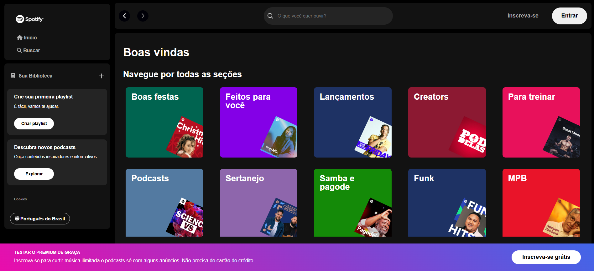

# Spotify Homepage 🎧🟩 (React)

Este projeto foi iniciado na quinta aula da **2ª edição da imersão Front-End da [Alura](https://www.alura.com.br/?srsltid=AfmBOorFKMXxXyiaLOD7mY6jsLzXksRHcAAA5TN4ismZd7wdULvTT3U5)** e concluído por mim. Ele simula a **homepage do Spotify**, proporcionando uma interface semelhante à plataforma de streaming de música. Foi desenvolvido com [React](https://react.dev/) e [Vite](https://vite.dev/), que juntos oferecem uma experiência de desenvolvimento rápida e moderna.

<div align="center">
  
</div>

## Tecnologias Utilizadas

- **React:** Biblioteca JavaScript para a construção da interface de usuário.
- **Vite:** Ferramenta de build rápida e eficiente, ideal para desenvolvimento com React.
- **Font Awesome:** Biblioteca de ícones.
- **JSON Server:** Simula uma API para fornecer dados de artistas.

## Como Rodar o Projeto

1. **Clone o repositório:**

```bash
git clone https://github.com/JosielJrr/spotify-homepage-react.git
```

2. **Entre no diretório do projeto:**

```bash
cd spotify-homepage-react
```

3. **Instale as dependências:**

```bash
npm install
```

4. **Inicie o JSON Server:**

```bash
npm run start:server
```

5. **Inicie o servidor de desenvolvimento:**

```bash
npm run dev
```
